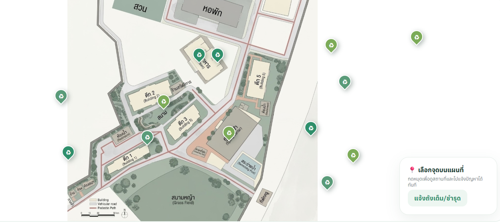
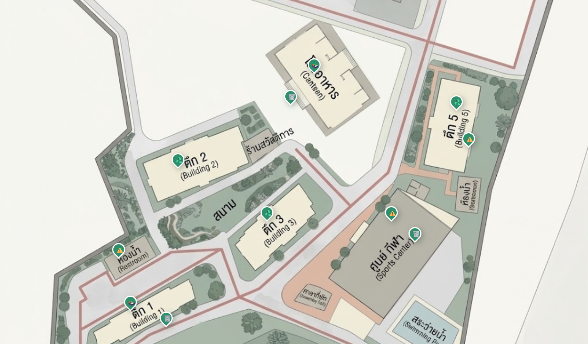
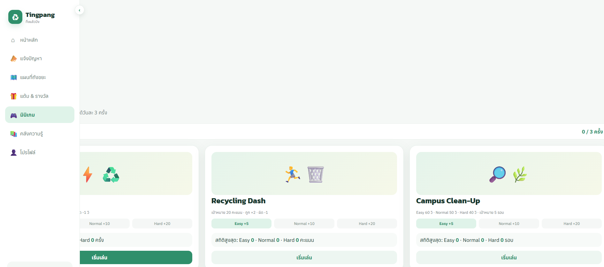
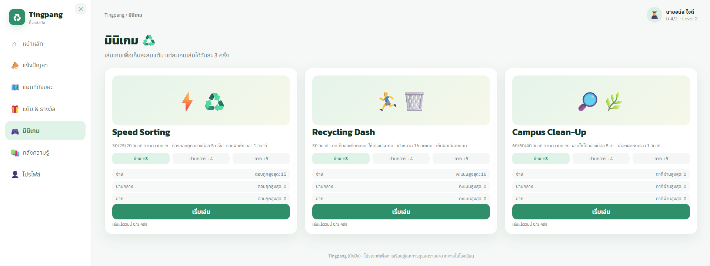

# Tingpang 
 

    เว็บแอพของเรา คือ ทิ้งปัง เพราะ "ทิ้งแล้วปัง"
    เป็นเว็บแอพสำหรับช่วยจัดการขยะ เศษอาหาร น้ำเสีย และกลิ่นเหม็นภายในโรงเรียนอิสลามวิทยาลัยแห่งประเทศไทย พร้อมระบบแต้มและกิจกรรมสนุก ๆ

### Prototype: 
[Tingpang in HTML](Tingpang.html)
 
**หรือ**
 
[Tingpang on Netlify](https://tingpang.netlify.app)
 

---
 

## โครงสร้างหน้าเว็บโดยรวม

| หน้า | หน้าที่ |
|---|---|
| 🏠 หน้าหลัก | ภาพรวมแต้ม/เลเวล/EXP/จำนวนรายงาน และเมนูลัดไปหน้าอื่น |
| 📣 แจ้งปัญหา  | ฟอร์มแจ้งจุดที่มีปัญหาขยะ/น้ำเสีย/กลิ่น |
| 🗺️ แผนที่ถังขยะ  | แผนที่โรงเรียนพร้อมหมุดตำแหน่งถังขยะ|
| 🎁 แต้ม & รางวัล  | แลกแต้มเป็นของรางวัลต่าง ๆ|
| 🎮 มินิเกม | มี 3 มินิเกมให้เล่นเพื่อเก็บแต้ม|
| 📚 คลังความรู้  | บทความ/อินโฟกราฟิก/วิดีโอความรู้เรื่องขยะ |
| 👤 โปรไฟล์  | ข้อมูลผู้ใช้ เลเวลผู้ใช้ ประวัติการใช้งาน และของรางวัลที่เคยแลก |

**แถบเมนูซ้าย (Sidebar):** กดปุ่ม ✕ ที่แถบเมนู หรือปุ่มลอย ☰ (ปรากฏเมื่อแถบถูกซ่อน) เพื่อเปิด/ปิดแถบเมนูสลับไปมาได้จากทั้งสองปุ่ม

---
 

## ระบบแต้ม (Points) และ เลเวล (ระดับการอนุรักษ์)

ทุกครั้งที่ได้แต้มจากกิจกรรมใด ๆ (รายงานปัญหา หรือเล่นมินิเกมผ่าน) ระบบจะ**บวก EXP เท่ากับจำนวนแต้มที่ได้รับ**โดยอัตโนมัติ (โดย 2 ค่านี้จะแยกจากกันโดยสิ้นเชิง)

### ค่าเริ่มต้นที่กำหนดให้ทดลองใช้
- Points เริ่มต้น: **450**
- EXP เริ่มต้น: **450** (อยู่ใน Level 2)

โดยผู้ใช้สามารถทดลองใช้งานเพื่อเลื่อนขั้นไปยัง Level 3 รวมถึงสามารถลองแลกรับรางวัลได้

### ตารางระดับ (Level)

| เลเวล | ชื่อ | ช่วง EXP |
|---|---|---|
| 1 | มือใหม่สายคลีน | 0–100 |
| 2 | ผู้พิทักษ์ถังขยะ | 101–500 |
| 3 | นักแยกขยะมือโปร | 501–1,200 |
| 4 | นักอนุรักษ์สิ่งแวดล้อม | 1,201–3,000 |
| 5 | ฮีโร่สิ่งแวดล้อม | 3,001 ขึ้นไป (เลเวลสูงสุด) |

---
 

## หน้าแจ้งปัญหา

สามารถแจ้งปัญหาที่เจอตามจุดต่าง ๆ ในโรงเรียนได้ โดยสามารถรับแต้มจากการแจ้งปัญหาได้วันละครั้ง ปัญหา เช่น 🗑️ ขยะ, 🍱 เศษอาหาร, 😷 กลิ่นเหม็น, 💧 น้ำเน่าเสีย และอื่น ๆ โดยสามารถระบุสถานที่ได้ดังนี้: โรงอาหาร, อาคารเรียน 1, อาคารเรียน 2, หลังอาคารเรียน 2, อาคารเรียน 3, อาคารเรียน 4, อาคารเรียน 5, บริเวณห้องน้ำ, สนามหญ้า, ศูนย์กีฬา, หอพัก และสระว่ายน้ำ ผู้ใช้ต้องเพิ่มคำอธิบายรายละเอียดด้วย และต้องแนบภาพหลักฐานด้วย

นอกจากนี้ ฟังก์ชันแจ้งปัญหา ยังมีระบบกันการสแปมด้วย ด้วยการให้ผู้ใช้ต้องรอ 1 นาที ก่อนส่งรายงานใหม่ หลังจากเพิ่งรายงานไปก่อนหน้า รวมถึงระบบที่ให้แต้มแค่วันละครั้งเท่านั้น ก็เพื่อให้จำกัดแต้มที่ผู้ใช้สามารถทำได้ ไม่ให้มากเกินไป

---
 

## หน้าแผนที่ถังขยะ

| ประเภท | ไอคอน | ตัวอย่างจุดที่ตั้ง |
|---|---|---|
| 🍱 เศษอาหาร | organic | โรงอาหาร, อาคารเรียน 1, หอพัก |
| ♻️ รีไซเคิล | recycle | อาคารเรียน 2, อาคารเรียน 3, อาคารเรียน 5 |
| ⚠️ อันตราย | hazardous | อาคารเรียน 5, ศูนย์กีฬา, บริเวณห้องน้ำ |
| 🗑️ ทั่วไป | general | โรงอาหาร, อาคารเรียน 1, ศูนย์กีฬา |

สามารถกดหมุดแต่ละอันเพื่อดูชื่อสถานที่ + ประเภทถังในกล่องข้อมูลมุมขวาล่าง และมีปุ่มลัดไปหน้า "แจ้งถังเต็ม/ชำรุด" ได้ทันที

---
 

## หน้าแต้ม & รางวัล

| รางวัล | แต้มที่ใช้ | จำนวนสิทธิ์ | การรีเซ็ต |
|---|---|---|---|
| 🍜 ส่วนลดโรงอาหาร | 100 Points | 8 สิทธิ์ | รีเซ็ตทุกเดือน |
| 📓 สมุดรักษ์โลก | 150 Points | 2 สิทธิ์ | รีเซ็ตทุกเดือน |
| 🏅 เกียรติบัตรคุณงามความดี | 3,000 Points | 1 สิทธิ์ | ไม่มีการรีเซ็ต (ถาวร) |

### เงื่อนไขตอนกด "กดแลกรางวัล"
1. ถ้า**สิทธิ์การแลกหมด** (เหลือ 0) → ปุ่มจะกลายเป็นสีเทา กดไม่ได้ และข้อความปุ่มเปลี่ยนเป็น "จำนวนการแลกถึงขีดจำกัดแล้ว"
2. ถ้า**แต้มไม่พอ** → ขึ้น popup "แต้มไม่พอ" บอกจำนวนที่มีอยู่กับจำนวนที่ต้องใช้
3. ถ้าผ่านทั้งสองเงื่อนไข → ขึ้น popup ยืนยันการแลก กด "ยืนยันการแลก" เพื่อหักแต้มจริง ลดสิทธิ์คงเหลือ 1 และบันทึกลงประวัติ "รางวัลที่เคยแลก" ในหน้าโปรไฟล์ พร้อม popup "แลกสำเร็จ"

---
 

## หน้ามินิเกม

ทุกมินิเกมสามารถเลือกระดับความยากได้ 3 ระดับ: **ง่าย / ปานกลาง / ยาก** และ**เล่นได้วันละ 3 ครั้งต่อเกม (นับรวมทุกระดับความยาก)**

### แต้มที่ได้รับเมื่อเล่นผ่านเกณฑ์ (เหมือนกันทั้ง 3 เกม)

| ระดับ | แต้มที่ได้ |
|---|---|
| ง่าย | +3 |
| ปานกลาง | +4 |
| ยาก | +5 |

แต้มที่ได้จะถูกบวกเข้า Points + EXP ทันที และบันทึกลง "ประวัติการใช้งาน" หน้าโปรไฟล์ นอกจากนี้ แต่ละเกมจะมีสถิติสูงสุดที่ผู้ใช้เคยเล่นไว้ได้แยกตามระดับความยาก

---

### 1. Speed Sorting (⚡♻️)
- เวลาเล่น: 30 / 25 / 20 วินาที ตามระดับ ง่าย / ปานกลาง / ยาก
- ระบบสุ่มภาพขยะขึ้นมาทีละชิ้น ให้กดปุ่มหมวดหมู่ที่ถูกต้อง (เศษอาหาร / รีไซเคิล / อันตราย / ทั่วไป)
- ตอบถูก → ได้คะแนนและสุ่มข้อถัดไปทันที
- ตอบผิด → หักเวลา 1 วินาที
- เงื่อนไขได้แต้ม: ต้องตอบถูกอย่างน้อย **5 ครั้ง** ภายในเวลาที่กำหนด

---

### 2. Recycling Dash (🏃‍♂️🗑️)
- เวลาเล่น: 30 วินาทีทุกระดับความยาก
- ระบบจะสุ่มกำหนด "ประเภทเป้าหมาย" ของตานั้น ๆ ขึ้นมา 1 ประเภท
- ขยะจะหล่นลงมาจากด้านบน ให้ผู้เล่นกดเก็บขยะให้ถูกประเภทตามโจทย์
  - กดถูกประเภทเป้าหมาย  **+2 คะแนน**
  - กดผิดประเภท  **-1 คะแนน**
- เป้าหมาย: ทำคะแนนให้ได้อย่างน้อย **16 คะแนน** ภายใน 30 วินาที จึงจะได้รับ Points ตามระดับความยาก

---

### 3. Campus Clean-Up (🔎🌿)
- เวลาเล่น: 60 / 50 / 40 วินาที ตามระดับความยาก ง่าย / ปานกลาง / ยาก
- แต่ละตา ระบบจะกำหนดประเภทขยะเป้าหมาย แล้วให้หาภาพขยะที่ตรงประเภทให้ครบ 4 ภาพ ท่ามกลางภาพขยะประเภทอื่นที่ปะปนอยู่ในตาราง (ทั้งหมด 16 ภาพ)
- หากเลือกผิดจะหักเวลา 1 วินาที ทันที
- ผ่านตาเมื่อเก็บภาพที่ถูกต้องครบ 4 ภาพ แล้วจะขึ้นตาใหม่ต่อเนื่องจนกว่าจะหมดเวลา
- เงื่อนไขได้แต้ม: ต้องผ่านให้ได้อย่างน้อย **5 ตา** ภายในเวลาที่กำหนด

---
 

## หน้าคลังความรู้

ประกอบไปด้วย:
- บทความเด่นประจำสัปดาห์
- INFOGRAPHIC
- VIDEO
- ARTICLE

---
 

## หน้าโปรไฟล์

- ข้อมูลผู้ใช้พื้นฐาน (ชื่อ, ชั้นเรียน, โรงเรียน)
- ระดับการอนุรักษ์ และ **EXP**
- แต้มสะสมคงเหลือที่ใช้แลกได้
- **ประวัติการใช้งาน** — log ทุกครั้งที่ได้แต้ม (จากรายงานหรือเกม) เรียงใหม่ล่าสุดอยู่บนสุด เริ่มต้นว่างเปล่า แสดง 5 รายการล่าสุด ถ้ามีมากกว่านั้นจะมีปุ่ม **"ดูทั้งหมด"** เปิด popup แสดงประวัติทั้งหมดใน 7 วันที่ผ่านมา
- **รางวัลที่เคยแลก** — log ทุกครั้งที่แลกของรางวัลสำเร็จ เริ่มต้นว่างเปล่า แสดง 5 รายการล่าสุด ถ้ามีมากกว่านั้นจะมีปุ่ม **"ดูทั้งหมด"** เปิด popup แสดงประวัติทั้งหมดใน 7 วันที่ผ่านมา

---
 
 

## Old (version) Prototype Vs. New (latest version) Prototype — สิ่งที่พัฒนาขึ้นมาจากเดิม

### หน้าแผนที่ถังขยะเก่า — การวางจุดถังขยะยังไม่แม่นยำ

### หน้าแผนที่ถังขยะใหม่ — จุดตำแหน่งถังขยะแม่นยำ

---

### หน้ามินิเกมเก่า — การจัดหน้าไม่เรียบร้อย ถูกแถบ **Sidebar** บัง แต้มที่ได้รับจากการเล่นมินิเกมไม่สมเหตุสมผล และมินิเกมมีความยากที่ยังไม่สมดุล

### หน้ามินิเกมใหม่ — การจัดหน้าเรียบร้อย ดูดีและสวยงามกว่าเดิม มีรายละเอียดมากขึ้น โดยตอนกดเล่นเกมจะมีการนับถอยหลัง 5 วินาที ระหว่างนั้นจะมีบอกกฎกติกาอย่างละเอียด แต้มที่ได้รับเองก็สมเหตุสมผลกับการแลกรางวัลและการอัพเลเวลมากขึ้น และความยากของมินิเกมก็สมดุลดี

---